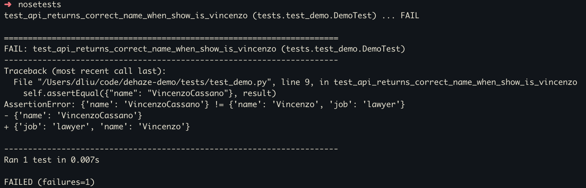
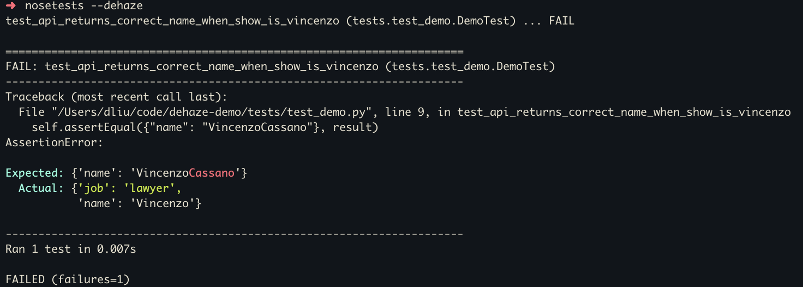

# nose-dehaze

A [nosetests](https://nose.readthedocs.io/en/latest/) plugin to format and colorize test failure output for readability.

Without `dehaze`:



With `dehaze`:



## Installation

```bash
pip install nose-dehaze
```

## Usage

Load the plugin explicitly when calling nosetests:

```bash
nosetests --dehaze
```

or set the environment variable:

```bash
export NOSE_DEHAZE=1

nosetests
```

Supported unittest assert methods:

* `assertEqual`
* `assertNotEqual`
* `assertEquals`
* `assertDictEqual`
* `assertSetEqual`
* `assertTupleEqual`
* `assertListEqual`
* `assertSequenceEqual`
* `assertIs`
* `assertIsNot`
* `assertIsNone`
* `assertIsNotNone`
* `assertIsInstance`
* `assertNotIsInstance`
* `assertTrue`
* `assertFalse`

Mocks assert methods:

* `assert_called_once`
* `assert_called_once_with`
* `assert_not_called`
* `assert_called_with`
* `assert_has_calls`

Currently, diff colorization output can vary, especially for more complex assert comparisons such as
large, nested dicts. This is a side effect of the way dehaze calculates diffs by utilizing difflib
and passing in stringified expected/actual values.

## Development

Refer to `Makefile` for commands to test, autoformat, lint, typecheck, etc.

```bash
pip install -r requirements.txt       # minimum to run code
pip install -r requirements-dev.txt   # for autoformat, lint, type checking, debugging
pip install -r requirements-test.txt  # for running tests
```

### Testing

```bash
# simply run tests
make test

# run tests with all supported python versions
make test-all
```
